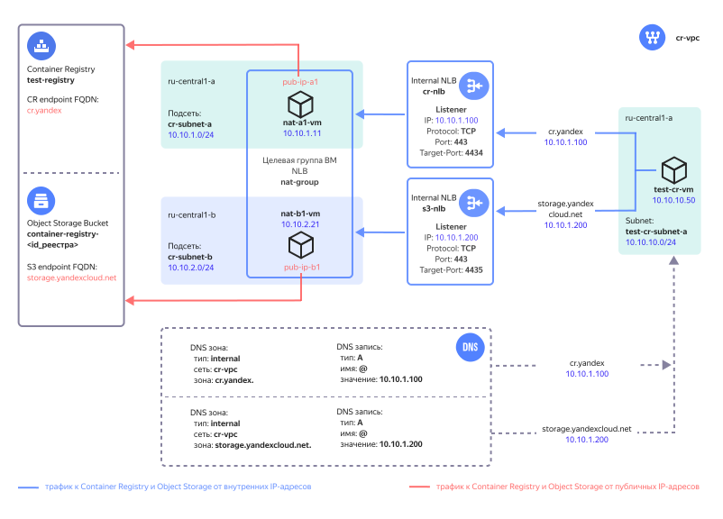

# Подключение к Container Registry из VPC

## Содержание
- [Описание решения](#описание-решения)
- [Рекомендации по развертыванию решения в продуктивной среде](#рекомендации-по-развертыванию-решения-в-продуктивной-среде)
- [Подготовка к развертыванию](#подготовка-к-развертыванию)
- [Развертывание Terraform сценария](#развертывание-terraform-сценария)
- [Проверка работоспособности](#проверка-работоспособности)
- [Удаление созданных ресурсов](#удаление-созданных-ресурсов)

## Описание решения

Для работы с [Container Registry](https://cloud.yandex.ru/ru/docs/container-registry/) облачным ресурсам требуется доступ в интернет. В данном сценарии вы развернете в Yandex Cloud облачную инфраструктуру для организации доступа к Container Registry для ресурсов, которые размещены в облачной сети [VPC](https://cloud.yandex.ru/docs/vpc/concepts/) и не имеют публичных IP-адресов или выхода в интернет через [NAT-шлюз](https://cloud.yandex.ru/docs/vpc/concepts/gateways).

Container Registry для хранения Docker-образов в реестре использует [Object Storage](https://cloud.yandex.ru/docs/storage/). В этом решении также организован доступ к Object Storage для ресурсов в VPC.



После развертывания решения в Yandex Cloud будут созданы следующие компоненты:

| Название | Описание |
| ---- | ---- |
| `cr-vpc` `*` | Облачная сеть с ресурсами, для которых организуется доступ к Container Registry. |
| `cr-nlb` | Внутренний сетевой балансировщик обеспечивает прием трафика к Container Registry. Балансировщик принимает TCP трафик с портом назначения 443 и распределяет его по ресурсам (ВМ) в целевой группе. |
| `nat-group` | Целевая группа балансировщиков с виртуальными машинами, на которых включена функция NAT. |
| `s3-nlb` | Внутренний сетевой балансировщик обеспечивает прием трафика к Object Storage. Балансировщик принимает TCP трафик с портом назначения 443 и распределяет его по ресурсам (ВМ) в целевой группе. |
| `nat-a1-vm`, `nat-b1-vm` | Виртуальные машины с NAT в зонах `ru-central1-a` и `ru-central1-b` для передачи трафика к Container Registry и Object Storage с трансляцией IP-адресов источников и получателей трафика, а также для передачи обратного трафика. | 
| `pub-ip-a1`, `pub-ip-b1` | Публичные IP-адреса ВМ, в которые облачная сеть VPC транслирует их внутренние IP-адреса. | 
| `DNS зоны и A-записи` | Внутренние DNS зоны `storage.yandexcloud.net.` и `cr.yandex.` в сети `cr-vpc` с ресурсными `A` записями, сопоставляющими доменные имена c IP-адресами внутренних сетевых балансировщиков. |
| `test-registry` | Реестр в Container Registry. |
| `container-registry-<id_реестра>` | Имя бакет в Object Storage для хранения Docker-образов, где `<id_реестра>` - идентификатор реестра. Сервис Container Registry автоматически создает в Object Storage бакет для реестра. |
| `cr-subnet-a`, `cr-subnet-b` | Облачные подсети для размещения ВМ с NAT в зонах `ru-central1-a` и `ru-central1-b`. |
| `test-cr-vm` | Тестовая ВМ для проверки доступа к Container Registry |
| `test-cr-subnet-a` | Облачная подсеть для размещения тестовой ВМ |

`*` *При развертывании можно также указать существующую облачную сеть*


Для облачной сети с размещаемыми ресурсами в сервисе [Cloud DNS](https://cloud.yandex.ru/docs/dns/concepts/) создаются внутренние DNS-зоны:
- `cr.yandex.` и ресурсная запись типа A, сопоставляющая доменное имя `cr.yandex` сервиса Container Registry c IP-адресом [внутреннего сетевого балансировщика](https://cloud.yandex.ru/docs/network-load-balancer/concepts/nlb-types) `cr-nlb`. 
- `storage.yandexcloud.net.` и ресурсная запись типа A, сопоставляющая доменное имя `storage.yandexcloud.net` сервиса Object Storage c IP-адресом внутреннего сетевого балансировщика `s3-nlb`. 

Благодаря этим записям трафик от облачных ресурсов к Container Registry и Object Storage будет направляться на внутренние балансировщики, которые будут распределять нагрузку по виртуальным машинам с NAT.

Для развертывания ВМ с NAT используется [образ из Marketplace](https://cloud.yandex.ru/marketplace/products/yc/nat-instance-ubuntu-22-04-lts), который транслирует IP-адреса источника и назначения, чтобы обеспечить маршрутизацию трафика до публичных IP-адресов Container Registry и Object Storage.

Разместив ВМ с NAT в нескольких [зонах доступности](https://cloud.yandex.ru/docs/overview/concepts/geo-scope), можно получить отказоустойчивость доступа к Container Registry. Увеличивая количество ВМ с NAT, можно масштабировать решение при возрастании нагрузки. При расчете количества ВМ с NAT следует учитывать [локальность при обработке трафика внутренним балансировщиком](https://cloud.yandex.ru/docs/network-load-balancer/concepts/specifics#nlb-int-locality). 

Доступ к реестру открыт только для облачных ресурсов, использующих данное решение. [Политика доступа для реестра](https://cloud.yandex.ru/ru/docs/container-registry/operations/registry/registry-access) разрешает действия с реестром только с публичных IP-адресов ВМ с NAT. Доступ к реестру с других IP-адресов запрещен. При необходимости это ограничение можно отключить с помощью параметра в Terraform.


## Рекомендации по развертыванию решения в продуктивной среде

- При развертывании ВМ с NAT в нескольких зонах доступности рекомендуется указывать четное число ВМ для их равномерного распределения по зонам доступности.
- Выбирая количество ВМ с NAT, следует учитывать [локальность при обработке трафика внутренним балансировщиком](https://cloud.yandex.ru/docs/network-load-balancer/concepts/specifics#nlb-int-locality).
- После ввода решения в эксплуатацию рекомендуется уменьшать количество ВМ с NAT или изменять список зон доступности в параметре `yc_availability_zones` только в заранее запланированный период времени. В процессе применения изменений возможны прерывания в обработке трафика.
- Если при возрастании нагрузки к Container Registry внутри ВМ с NAT наблюдается большое значение метрики `CPU steal time`, то для ВМ с NAT рекомендуется включить [программно-ускоренную сеть](https://cloud.yandex.ru/ru/docs/vpc/concepts/software-accelerated-network).
- В случае использования собственного DNS сервера в его настройках необходимо создать ресурсные `A` записи вида:

    | Имя | Тип | Значение |
    | ----------- | ----------- | ----------- |
    | `cr.yandex.` | `A` | `<IP-адрес внутреннего балансировщика для Container Registry из вывода команды terraform output cr_nlb_ip_address>` |
    | `storage.yandexcloud.net.` | `A` | `<IP-адрес внутреннего балансировщика для Object Storage из вывода команды terraform output s3_nlb_ip_address>` |
    
- Сохраните приватный SSH ключ `pt_key.pem`, используемый для подключения к ВМ с NAT, в надежное место либо пересоздайте его отдельно от Terraform.
- После развертывания решения доступ по SSH к ВМ c NAT будет закрыт. Для разрешения доступа к ВМ с NAT по протоколу SSH добавьте входящее правило для SSH трафика (TCP/22) в группе безопасности `cr-nat-sg`, чтобы разрешить доступ только с определенных IP-адресов рабочих мест администраторов.
- После проверки работоспособности удалите тестовую ВМ и её подсеть.


## Подготовка к развертыванию

1. Перед выполнением развертывания нужно [зарегистрироваться в Yandex Cloud и создать платежный аккаунт](https://cloud.yandex.ru/docs/tutorials/infrastructure-management/terraform-quickstart#before-you-begin)

2. [Установите Terraform](https://cloud.yandex.ru/docs/tutorials/infrastructure-management/terraform-quickstart#install-terraform)

3. Проверьте наличие учетной записи в облаке с правами `admin` на каталог

4. [Установите и настройте Yandex Cloud CLI](https://cloud.yandex.ru/docs/cli/quickstart)

5. [Установите Git](https://github.com/git-guides/install-git)

6. Проверьте квоты в облаке, чтобы была возможность развернуть ресурсы в сценарии:

    <details>
    <summary>Посмотреть справочную информацию по количеству ресурсов, создаваемых в сценарии</summary>

    | Ресурс | Количество |
    | ----------- | ----------- |
    | Виртуальные машины | 3 |
    | vCPU виртуальных машин | 6 |
    | RAM виртуальных машин | 6 ГБ |
    | Диски | 3 |
    | Объем HDD дисков | 30 ГБ |
    | Объем SSD дисков | 20 ГБ |
    | Сетевой балансировщик | 2 |
    | Целевая группа для балансировщика | 1 |
    | Сети | 1`*` |
    | Подсети | 3 |
    | Статические публичные IP-адреса | 2 |
    | Группы безопасности | 1 |
    | Зона DNS | 2 |
    | Реестр | 1 |  
    | Сервисный аккаунт | 1 |

    `*` *Если пользователь в `terraform.tfvars` не указал идентификатора существующей сети.*

    </details>


7. Перед развёртыванием решения уже должен существовать каталог облачных ресурсов в Yandex Cloud, в котором будут размещаться компоненты решения.


## Развертывание Terraform сценария

1. На вашей рабочей станции склонируйте [репозиторий](https://github.com/yandex-cloud-examples/yc-cr-private-endpoint/) `yandex-cloud-examples/yc-cr-private-endpoint` из GitHub и перейдите в папку сценария `yc-cr-private-endpoint`:
    ```bash
    git clone https://github.com/yandex-cloud-examples/yc-cr-private-endpoint.git
    
    cd yc-cr-private-endpoint
    ```

2. Настройте окружение для развертывания ([подробности](https://cloud.yandex.ru/docs/tutorials/infrastructure-management/terraform-quickstart#get-credentials)):
    ```bash
    export YC_TOKEN=$(yc iam create-token)
    ```

3. Заполните файл `terraform.tfvars` вашими значениями. Обязательные параметры для изменения отмечены в таблице.

    <details>
    <summary>Посмотреть детальную информацию о заполняемых значениях</summary>

    | Название<br>параметра | Нужно<br>изменение | Описание | Тип | Пример |
    | --- | --- | --- | --- | --- |
    | `folder_id` | да | ID каталога для размещения компонент решения. | `string` | `b1gentmqf1ve9uc54nfh` |
    | `vpc_id` | - | ID облачной сети, для которой организуется доступ к Container Registry. Если не указано, то VPC будет создана. | `string` | `enp48c1ndilt42veuw4x` |
    | `yc_availability_zones` | - | Список <a href="https://cloud.yandex.ru/docs/overview/concepts/geo-scope">зон доступности</a> для развертывания ВМ с NAT.  | `list(string)` | `["ru-central1-a", "ru-central1-b"]` |
    | `subnet_prefix_list` | - | Список префиксов облачных подсетей для размещения ВМ с NAT (по одной подсети в каждой зоне доступности из списка `yc_availability_zones`, перечисленных в том же порядке). | `list(string)` | `["10.10.1.0/24", "10.10.2.0/24"]` |
    | `nat_instances_count` | - | Количество разворачиваемых ВМ с NAT. Рекомендуется указывать четное число для равномерного распределения ВМ по зонам доступности. | `number` | `2` |
    | `registry_private_access` | - | Ограничить доступ к реестру только с публичных IP-адресов ВМ с NAT. Используется значение `true` для ограничения, `false` для отмены ограничения. | `bool` | `true` |
    | `trusted_cloud_nets` | да | Список агрегированных префиксов облачных подсетей, для которых разрешен доступ к Container Registry. Используется во входящем правиле групп безопасности для ВМ с NAT.  | `list(string)` | `["10.0.0.0/8", "192.168.0.0/16"]` |
    | `vm_username` | - | Имя пользователя для ВМ с NAT и тестовой ВМ. | `string` | `admin` |
    | `cr_ip` | - | Публичный IP-адрес сервиса Container Registry. | `string` | `84.201.171.239` |
    | `cr_fqdn` | - | Доменное имя сервиса Container Registry. | `string` | `cr.yandex` | 
    | `s3_ip` | - | Публичный IP-адрес сервиса Object Storage. | `string` | `213.180.193.243` |
    | `s3_fqdn` | - | Доменное имя сервиса Object Storage. | `string` | `storage.yandexcloud.net` |  
    
    </details>

4. Выполните инициализацию Terraform:
    ```bash
    terraform init
    ```

5. Проверьте список создаваемых облачных ресурсов:
    ```bash
    terraform plan
    ```

6. Создайте ресурсы:
    ```bash
    terraform apply
    ```

7. После завершения процесса `terraform apply` в командной строке будет выведен список информации для подключения к тестовой ВМ и тестирования работы с Container Registry. В дальнейшем его можно будет посмотреть с помощью команды `terraform output`:

    <details>
    <summary>Посмотреть информацию о развернутых ресурсах</summary>

    | Название | Описание | Пример значения |
    | ----------- | ----------- | ----------- |
    | `cr_nlb_ip_address` | IP-адрес внутреннего балансировщика для Container Registry. | `10.10.1.100` |
    | `cr_registry_id` | Идентификатор реестра в Container Registry. | `crp1r4h00mj*********` |
    | `path_for_private_ssh_key` | Файл с private ключом для подключения по протоколу SSH к ВМ с NAT и тестовой ВМ. | `./pt_key.pem` |
    | `s3_nlb_ip_address` | IP-адрес внутреннего балансировщика для Object Storage. | `10.10.1.200` |
    | `test_vm_password` | Пароль пользователя `admin` для тестовой ВМ. | `v3RСqUrQN?x)` |
    | `vm_username` | Имя пользователя для ВМ с NAT и тестовой ВМ. | `admin` |
    
    </details>


## Проверка работоспособности

1. В консоли Yandex Cloud в каталоге `folder_id` выберите сервис `Compute Cloud` и в списке виртуальных машин выберите ВМ `test-cr-vm`. Подключитесь к серийной консоли ВМ, введите логин `admin` и пароль из вывода команды `terraform output test_vm_password` (укажите значение без кавычек).

2. В серийной консоли ВМ выполните команду `dig cr.yandex storage.yandexcloud.net` и убедитесь, что в ответе от DNS сервера доменному имени сервиса Object Storage и Container Registry соответствуют IP-адреса внутренних балансировщиков. Выдержка из результатов вывода ресурсных `A` записей:
    ```
    ;; ANSWER SECTION:
    cr.yandex.               300    IN      A       10.10.1.100
    
    ;; ANSWER SECTION:
    storage.yandexcloud.net. 300    IN      A       10.10.1.200
    ```

3. Посмотрите список доступных для загрузки Docker-образов: 

    ```
    docker image list
    ```

    Результат:
    ```
    REPOSITORY    TAG       IMAGE ID       CREATED        SIZE
    golang        1.20.5    342*********   8 months ago   777MB
    hello-world   latest    9c7*********   9 months ago   13.3kB
    ```

4. Присвойте Docker-образу URL вида `cr.yandex/<идентификатор_реестра>/<имя_Docker-образа>:<тег>`. Идентификатор реестра будет получен из переменной среды на тестовой ВМ:
   
    ```
    docker tag hello-world cr.yandex/$REGISTRY_ID/hello-world:demo

    docker image list
    ```
    
    Результат:
    ```
    REPOSITORY                                   TAG       IMAGE ID       CREATED        SIZE
    golang                                       1.20.5    342*********   8 months ago   777MB
    cr.yandex/crp1r4h00mj*********/hello-world   demo      9c7*********   9 months ago   13.3kB
    hello-world                                  latest    9c7*********   9 months ago   13.3kB
    ```

    > **Примечание**
    >
    > Загрузить в Container Registry можно только Docker-образы с URL вида `cr.yandex/<идентификатор_реестра>/<имя_Docker-образа>:<тег>`.

5. Загрузите необходимый Docker-образ в реестр: 

    ```
    docker push cr.yandex/$REGISTRY_ID/hello-world:demo
    ```

    Результат:
    ```
    The push refers to repository [cr.yandex/crp1r4h00mj*********/hello-world]
    01bb4*******: Pushed 
    demo: digest: sha256:7e9b6e7ba284****************** size: 525
    ```

6. Проверьте, что образ загрузился в реестр. В консоли Yandex Cloud в каталоге `folder_id` выберите сервис `Container Registry`, выберите реестр `test-registry`. В реестре должен появиться репозиторий `hello-world` с Docker-образом.


## Удаление созданных ресурсов

В консоли Yandex Cloud в каталоге `folder_id` выберите сервис `Container Registry`, выберите реестр `test-registry` и удалите в нём все Docker-образы. Далее для удаления ресурсов, созданных с помощью Terraform, выполните команду `terraform destroy`.

> **Важно**
> 
> Terraform удалит все ресурсы, которые были созданы при развертывании решения, без возможности восстановления.

