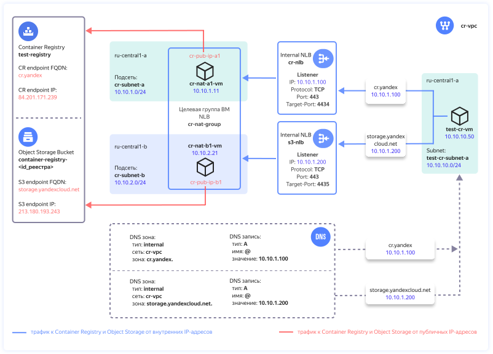

# Connecting to Container Registry from a VPC

## Contents

- [About the solution](#описание-решения)
- [Tips for solution deployment in the production environment](#рекомендации-по-развертыванию-решения-в-продуктивной-среде)
- [Preparing for deployment](#подготовка-к-развертыванию)
- [Deploying Terraform configuration](#развертывание-terraform-сценария)
- [Health check](#проверка-работоспособности)
- [Deleting the created resources](#удаление-созданных-ресурсов)

## About the solution

To access [Container Registry](https://yandex.cloud/en/ru/docs/container-registry/), cloud resources need Internet access. In this example, you will deploy a cloud infrastructure in Yandex Cloud to set up access to Container Registry for resources that are hosted in the [VPC](https://yandex.cloud/en/docs/vpc/concepts/) cloud network and have no public IP addresses or access to the Internet through a [NAT gateway](https://yandex.cloud/en/docs/vpc/concepts/gateways).

Container Registry uses [Object Storage](https://yandex.cloud/en/docs/storage/) to store Docker images in a registry. This example also provides access to Object Storage for resources in VPC.



While deploying this solution, you will be creating the following components in Yandex Cloud:

| Name | Description |
| ---- | ---- |
| `cr-vpc` `*` | Cloud network with the resources for which access to Container Registry is set up. |
| `cr-nlb` | Internal network load balancer accepting traffic to Container Registry. The load balancer accepts TCP traffic with destination port 443 and distributes it across resources (VMs) in a target group. |
| `nat-group` | Load balancer target group with VMs that have the NAT function enabled. |
| `s3-nlb` | Internal network load balancer accepting traffic to Object Storage. The load balancer accepts TCP traffic with destination port 443 and distributes it across resources (VMs) in a target group. |
| `nat-a1-vm`, `nat-b1-vm` | VMs with NAT in the `ru-central1-a` and `ru-central1-b` zones for routing traffic to Container Registry and Object Storage with translation of IP addresses of traffic sources and targets, as well as for routing the return traffic. | 
| `pub-ip-a1`, `pub-ip-b1` | VM public IP addresses to which the VPC cloud network translates their internal IP addresses. | 
| `DNS zones and A records` | The `storage.yandexcloud.net.` and `cr.yandex.` internal DNS zones in the `cr-vpc` network with `A` resource records mapping domain names to IP addresses of internal network load balancers. |
| `test-registry` | Test registry in Container Registry. |
| `container-registry-<registry_ID>` | Name of the Object Storage bucket for storing Docker images, where `<registry_ID>` is the registry ID. Container Registry automatically creates an Object Storage bucket for that registry. |
| `cr-subnet-a`, `cr-subnet-b` | Cloud subnets to host NAT instances in the `ru-central1-a` and `ru-central1-b` zones. |
| `test-cr-vm` | Test VM to verify access to Container Registry. |
| `test-cr-subnet-a` | Cloud subnet to host the test VM. |

`*` *When deploying, you can also specify an existing cloud network.*


For the cloud network with resources to host in [Cloud DNS](https://yandex.cloud/en/docs/dns/concepts/), the following internal DNS zones are created:
- `cr.yandex.` and an `A` resource record that maps the `cr.yandex` domain name of Container Registry to the IP address of the `cr-nlb` [internal network load balancer](https://yandex.cloud/en/docs/network-load-balancer/concepts/nlb-types). 
- `storage.yandexcloud.net.` and an `A` resource record that maps the `storage.yandexcloud.net` domain name of Object Storage to the IP address of the `s3-nlb` internal network load balancer. 

With these records, traffic from cloud resources to Container Registry and Object Storage will be routed to the internal load balancers that will distribute the load across the NAT instances.

To deploy a NAT instance, an [image from Marketplace](https://yandex.cloud/en/marketplace/products/yc/nat-instance-ubuntu-22-04-lts) is used that translates the source and target IP addresses to ensure traffic routing to the Container Registry and Object Storage public IP addresses.

By placing the NAT instances in multiple [availability zones](https://yandex.cloud/en/docs/overview/concepts/geo-scope), you can ensure fault-tolerant access to Container Registry. By increasing the number of NAT instances, you can scale the solution up if the workload increases. When calculating the number of NAT instances, consider the [locality of traffic handling by the internal load balancer](https://yandex.cloud/en/docs/network-load-balancer/concepts/specifics#nlb-int-locality). 

Only the cloud resources that use this solution can access the registry. The [registry access policy](https://yandex.cloud/en/ru/docs/container-registry/operations/registry/registry-access) allows registry actions only from public IP addresses of NAT instances. You cannot access the registry from other IP addresses. You can disable this limitation by specifying the relevant parameter in Terraform, if required.


## Tips for solution deployment in the production environment

- When deploying NAT instances in multiple availability zones, set an even number of VMs to evenly distribute them across the availability zones.
- When selecting the number of NAT instances, consider the [locality of traffic handling by the internal load balancer](https://yandex.cloud/en/docs/network-load-balancer/concepts/specifics#nlb-int-locality).
- Once the solution is deployed, reduce the number of NAT instances or update the list of availability zones in the `yc_availability_zones` parameter only during a pre-scheduled time window. When the changes are being applied, traffic handling may be interrupted.
- If a NAT instance demonstrates a high `CPU steal time` metric value as the Container Registry workload goes up, we recommend enabling a [software-accelerated network](https://yandex.cloud/en/ru/docs/vpc/concepts/software-accelerated-network) for that NAT instance.
- When using a custom DNS server, make sure to create type `A` records in its configuration. These records must be in the following format:

    | Name | Type | Value |
    | ----------- | ----------- | ----------- |
    | `cr.yandex.` | `A` | `<IP address of the internal load balancer for Container Registry from the `terraform output cr_nlb_ip_address` command output>` |
    | `storage.yandexcloud.net.` | `A` | `<IP address of the internal load balancer for Object Storage from the `terraform output s3_nlb_ip_address` command output>` |
    
- Save the `pt_key.pem` private SSH key used to connect to the NAT instances to a secure location or recreate it separately from Terraform.
- Once the solution is deployed, SSH access to the NAT instances will be disabled. To enable it, add a rule for incoming SSH traffic (TCP/22) in the `cr-nat-sg` security group, which will allow access only from certain IP addresses of admin workstations.
- After the health check, delete the test VM and its subnet.


## Preparing for deployment

1. Before starting the deployment, [sign up for Yandex Cloud and create a billing account](https://yandex.cloud/en/docs/tutorials/infrastructure-management/terraform-quickstart#before-you-begin).

1. [Install Terraform](https://yandex.cloud/en/docs/tutorials/infrastructure-management/terraform-quickstart#install-terraform).

1. Check if there is an account in the cloud with `admin` permissions for the folder.

1. [Install and configure the Yandex Cloud CLI](https://yandex.cloud/en/docs/cli/quickstart).

1. [Install Git](https://github.com/git-guides/install-git).

1. Check whether your cloud quotas allow you to deploy your resources for this scenario:

    <details>
    <summary>Expand to see the amount of resources created for this scenario</summary>

    | Resource | Amount |
    | ----------- | ----------- |
    | Virtual machines | 3 |
    | VM vCPUs | 6 |
    | VM RAM | 6 GB |
    | Disks | 3 |
    | HDD size | 30 GB |
    | SSD size | 20 GB |
    | Network load balancer | 2 |
    | Target group for the load balancer | 1 |
    | Networks | 1`*` |
    | Subnets | 3 |
    | Static public IP addresses | 2 |
    | Security groups | 1 |
    | DNS zone | 2 |
    | Registry | 1 |  
    | Service accounts | 1 |

    `*` *If the user did not specify the existing network ID in `terraform.tfvars`*.

    </details>


1. Make sure you have a cloud resource folder in Yandex Cloud before proceeding to deployment.


## Deploying Terraform configuration

1. Clone the `yandex-cloud-examples/yc-cr-private-endpoint` GitHub [repository](https://github.com/yandex-cloud-examples/yc-cr-private-endpoint/) to your local machine and go to the `yc-cr-private-endpoint` directory:
    ```bash
    git clone https://github.com/yandex-cloud-examples/yc-cr-private-endpoint.git
    
    cd yc-cr-private-endpoint
    ```

1. Set up the deployment environment (see the details [here](https://yandex.cloud/en/docs/tutorials/infrastructure-management/terraform-quickstart#get-credentials)):
    ```bash
    export YC_TOKEN=$(yc iam create-token)
    ```

1. Enter your custom values in the `terraform.tfvars` file. Refer to the table below to see which parameters need changing.

    <details>
    <summary>View detailed info on the values to enter</summary>

    | Parameter<br>name | Needs<br>editing | Description | Type | Example |
    | --- | --- | --- | --- | --- |
    | `folder_id` | Yes | ID of the folder to host the solution components. | `string` | `b1gentmqf1ve9uc54nfh` |
    | `vpc_id` | - | ID of the cloud network for which access to Container Registry is set up. If skipped, a VPC will be created. | `string` | `enp48c1ndilt42veuw4x` |
    | `yc_availability_zones` | - | List of the <a href="https://yandex.cloud/en/docs/overview/concepts/geo-scope">availability zones</a> for deploying NAT instances  | `list(string)` | `["ru-central1-a", "ru-central1-b"]` |
    | `subnet_prefix_list` | - | List of prefixes of cloud subnets to host the NAT instances (one subnet in each availability zone from the `yc_availability_zones` list in the same order). | `list(string)` | `["10.10.1.0/24", "10.10.2.0/24"]` |
    | `nat_instances_count` | - | Number of NAT instances to deploy. We recommend setting an even number to evenly distribute the instances across the availability zones. | `number` | `2` |
    | `registry_private_access` | - | Only allow registry access from public IP addresses of NAT instances. `true` means the access is limited. To remove the limit, set `false`. | `bool` | `true` |
    | `trusted_cloud_nets` | Yes | List of aggregated prefixes of cloud subnets that Container Registry access is allowed for. It is used in the rule for incoming traffic of security groups for the NAT instances.  | `list(string)` | `["10.0.0.0/8", "192.168.0.0/16"]` |
    | `vm_username` | - | NAT instance and test VM user names. | `string` | `admin` |
    | `cr_ip` | - | Container Registry public IP address. | `string` | `51.250.44.40` |
    | `cr_fqdn` | - | Container Registry domain name. | `string` | `cr.yandex` | 
    | `s3_ip` | - | Object Storage public IP address. | `string` | `213.180.193.243` |
    | `s3_fqdn` | - | Object Storage domain name. | `string` | `storage.yandexcloud.net` |  
    
    </details>

1. Initialize Terraform:
    ```bash
    terraform init
    ```

1. Check the list of cloud resources you are about to create:
    ```bash
    terraform plan
    ```

1. Create resources:
    ```bash
    terraform apply
    ```

1. Once `terraform apply` is complete, the command line will output the info required for connecting to the test VM and running test operations with Container Registry. Later on, you can view this information by running the `terraform output` command:

    <details>
    <summary>Expand to view the information on deployed resources</summary>

    | Parameter | Description | Sample value |
    | ----------- | ----------- | ----------- |
    | `cr_nlb_ip_address` | IP address of the internal load balancer for Container Registry. | `10.10.1.100` |
    | `cr_registry_id` | ID of the registry in Container Registry. | `crp1r4h00mj*********` |
    | `path_for_private_ssh_key` | File with a private key used to connect to the NAT instances and test VM over SSH. | `./pt_key.pem` |
    | `s3_nlb_ip_address` | IP address of the internal load balancer for Object Storage. | `10.10.1.200` |
    | `test_vm_password` | `admin` user password for the test VM. | `v3RСqUrQN?x)` |
    | `vm_username` | NAT instance and test VM user names. | `admin` |
    
    </details>


## Health check

1. In the Yandex Cloud console, navigate to the `folder_id` folder, select `Compute Cloud` and then `test-cr-vm` from the list of VMs. Connect to the VM serial console, enter the `admin` username and the password from the `terraform output test_vm_password` command output (without quotation marks).

1. In the VM serial console, run the `dig cr.yandex storage.yandexcloud.net` command and verify that the Object Storage and Container Registry domain names in the DNS server response match the IP addresses of the appropriate internal load balancers. In the output of the type `A` resource records, there should be sections as follows:
    ```
    ;; ANSWER SECTION:
    cr.yandex.               300    IN      A       10.10.1.100
    
    ;; ANSWER SECTION:
    storage.yandexcloud.net. 300    IN      A       10.10.1.200
    ```

1. View the list of available Docker images: 

    ```
    docker image list
    ```

    Result:
    ```
    REPOSITORY    TAG       IMAGE ID       CREATED        SIZE
    golang        1.20.5    342*********   8 months ago   777MB
    hello-world   latest    9c7*********   9 months ago   13.3kB
    ```

1. Assign a URL to the Docker image using the following format: `cr.yandex/<registry_ID>/<Docker_image_name>:<tag>`. The registry ID will be obtained from the test VM environment variable:
   
    ```
    docker tag hello-world cr.yandex/$REGISTRY_ID/hello-world:demo

    docker image list
    ```
    
    Result:
    ```
    REPOSITORY                                   TAG       IMAGE ID       CREATED        SIZE
    golang                                       1.20.5    342*********   8 months ago   777MB
    cr.yandex/crp1r4h00mj*********/hello-world   demo      9c7*********   9 months ago   13.3kB
    hello-world                                  latest    9c7*********   9 months ago   13.3kB
    ```

    > **Note**
    >
    > You can only push Docker images to Container Registry if they have a URL in this format: `cr.yandex/<registry_ID>/<Docker_image_name>:<tag>`.

1. Push the required Docker image to the registry: 

    ```
    docker push cr.yandex/$REGISTRY_ID/hello-world:demo
    ```

    Result:
    ```
    The push refers to repository [cr.yandex/crp1r4h00mj*********/hello-world]
    01bb4*******: Pushed 
    demo: digest: sha256:7e9b6e7ba284****************** size: 525
    ```

1. Check that the image push to the registry is complete. In the Yandex Cloud console, navigate to the `folder_id` folder, select `Container Registry` and then `test-registry`. The registry should house the `hello-world` repo with the Docker image.


## Deleting the created resources

In the Yandex Cloud console, navigate to the `folder_id` folder, select `Container Registry`. Select `test-registry` and delete all Docker images in the registry. Then, run `terraform destroy` to delete resources created using Terraform.

> **Important**
> 
> Terraform will permanently delete all the resources that were created while deploying the solution.

